# Deployment of Static Website in React to S3 Storage using Bamboo DevOps

Requirement to host a static react website in Windows using Bamboo. Additional requirement that all testing, building and deployment should be automated using CI/CD in Bamboo.

# Important pre-requisites

Make sure Java JDK & Git Bash are properly installed and defined into the Environment Variables

**Variable name:** JAVA_HOME
**Variable value:** C:\Program Files\Java\jdk-15.0.2

**Variable name:** JRE_HOME
**Variable value:** C:\Program Files\Java\jre1.8.0_281

# Install Bamboo Server (Latest v7.2.2)

Installation directory: C:\Program Files\Bamboo
Bamboo home directory: C:\Users\MyUser\bamboo-home

a) In the command line, change the directory to <Installation Directory> and run the command to start Bamboo:
`cd <Bamboo Installation directory>`
`cd 'C:\Program Files\Bamboo\'`
`.\bin\start-bamboo.bat`

After succesfully starting Bamboo, you will find it online at http://localhost:8085/

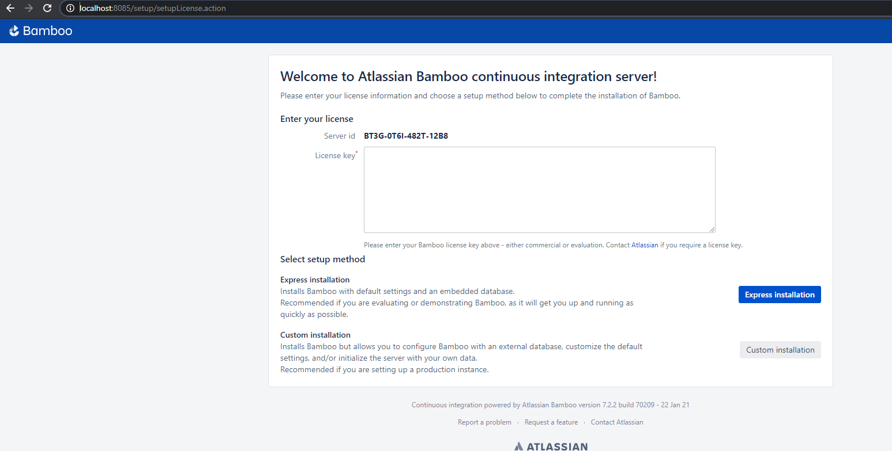

# Setup Bamboo

The welcome page for Bamboo will ask for a license key.
After getting the license key from Atlassian, we can move forward with the Setup Method.

Express or Custom installation depends on the database and settings we need to setup.
For simplicity we are going to select "Express Installation"

# Setup Administrator User

Please enter the details of the administrator user for the bamboo installation
username, password, fullname and email.

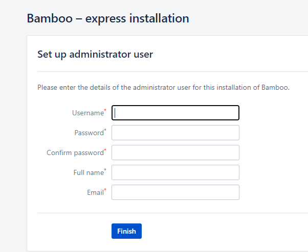

# Configure Plan

A plan in bamboo defines everything about the build process.

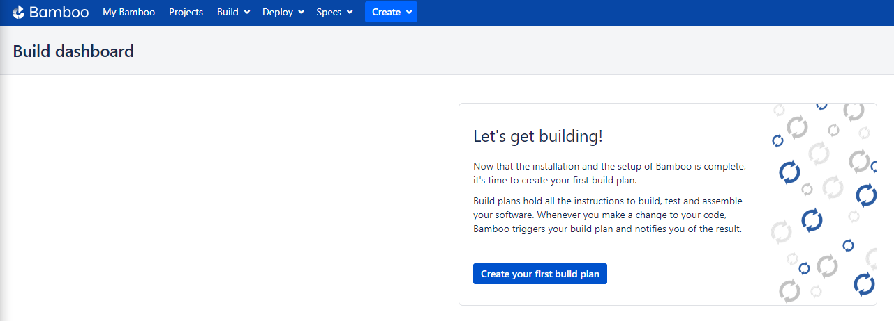

Setup the following:
Project Name, Project Key, Plan Name, Plan Key, Repository Host, for this we are going to "Link new repository"
**Display name:** Temp-OAST-CI-CD Repo
**Username:** {{Github Username}}
**Personal Access token:** {{Github Personal Token}}

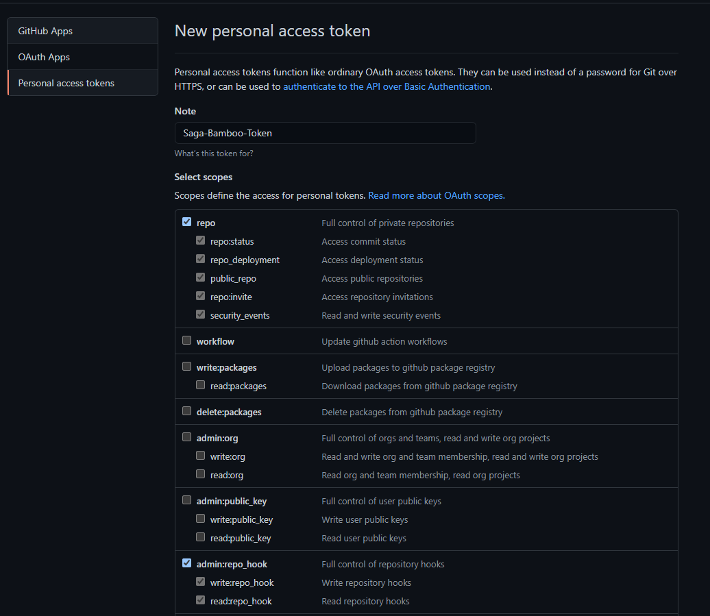

**Repository:** Click "Load Repositories" then select the repository you want to use for your Plan.

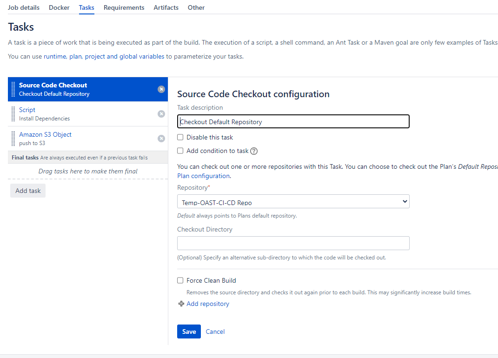

**Branch:** Select the branch you want to check out your code from.
Click "Configure Plan"

# Configure the Job

Click "Add Task" -> Search for "Script" -> Interpreter "Shell" -> Script Location "Inline"
In Script Body type the following:

```
#!"C:\Program Files\Git\bin\bash.exe"
npm install --global yarn
npm install --global lerna
npm install --global typescript
npx lerna bootstrap
npx yarn install
NODE_ENV=production yarn --cwd=packages/react build
NODE_ENV=production yarn --cwd=packages/styles build
yarn build
yarn dev &
sleep 5
yarn generate-pa11y-axe-report
yarn print-pa11y-axe-cli-results
yarn test-pa11y-htmlcs
yarn generate-pa11y-htmlcs-report
yarn print-pa11y-htmlcs-cli-results
```

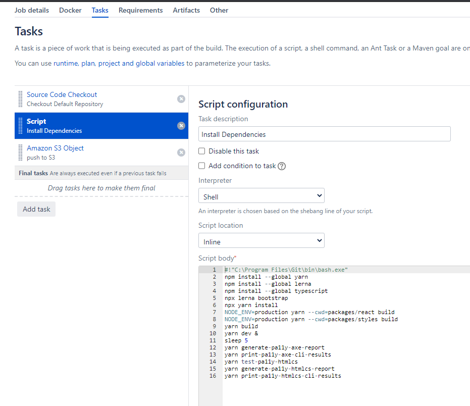

# Amazon S3 Object

In order to send the artifact into S3, we need to download the Amazon S3 Plugin from Atlassian Marketplace.
After installing the plugin and get the licensed, we can proceed.

Click "Add Task"
Search "Amazon S3 Object"
Setup Task to "Upload File(s)"
Region "US East (N.Virginia)"
Artifact "Local Files..."
Source Local Path "docs/dist/"
Select "Use default excludes when selecting files"
Target Bucket Name: bamboo-static-website
AWS Security Credentials -> Source "Inline" -> Access Key ID and Access Secret from AWS IAM.

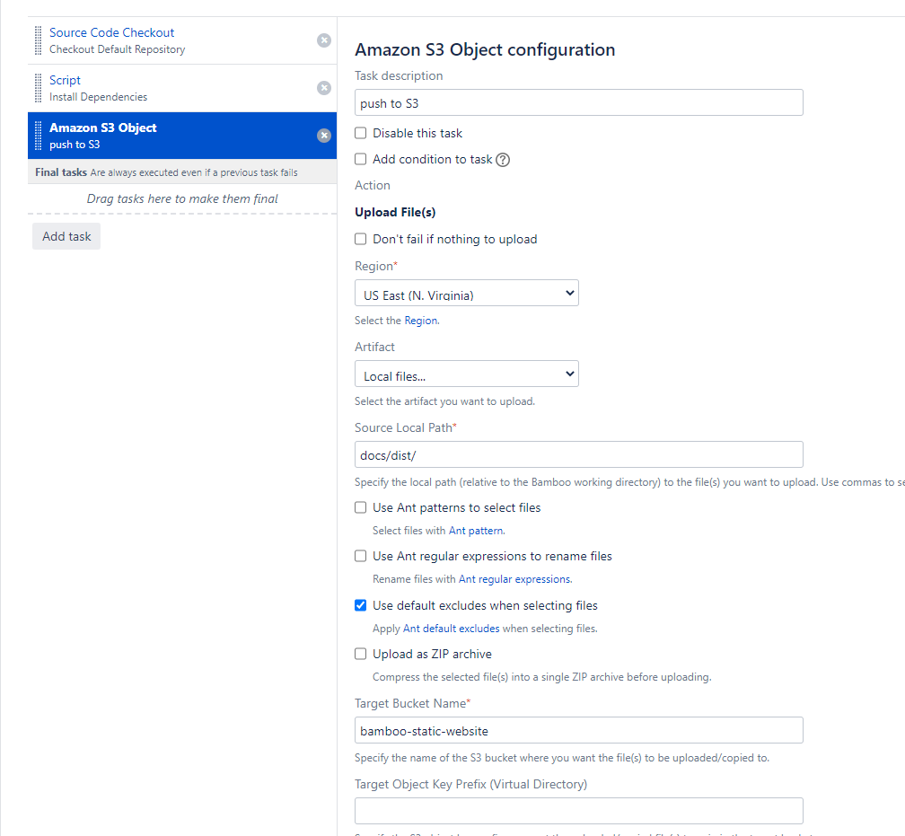

# Setup Artifacts

Click on "Artifacts" inside of the Job and Select "Create artifact"
Name: ArchiveFiles
Location: \${bamboo.working.directory}/docs/dist
Copy pattern: \*

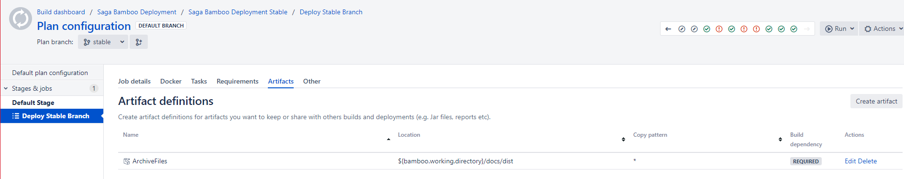

# Run Plan

This will kickoff the pipeline and build the react application at localhost:8000, then it will run the pa11y test.
The pipeline will generate the artifact and upload the directory into the S3 bucket.

# Results

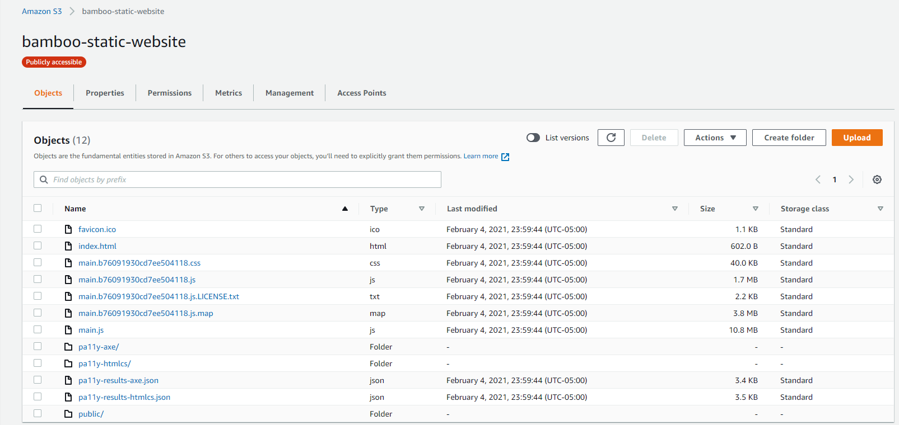

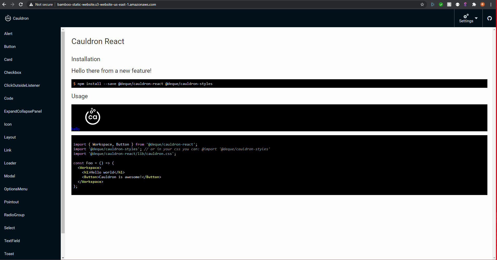

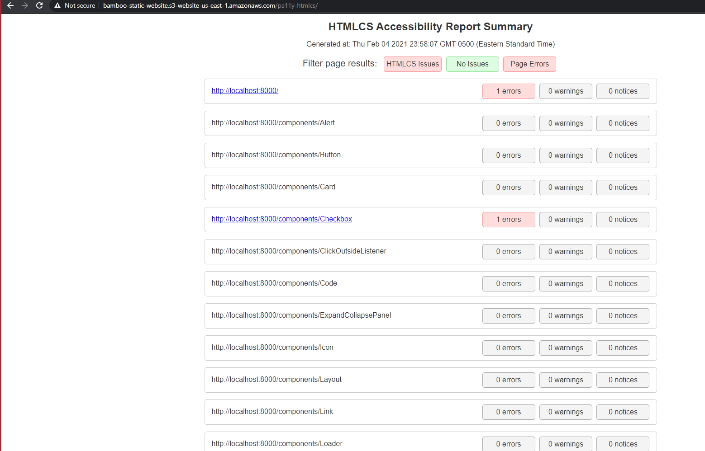


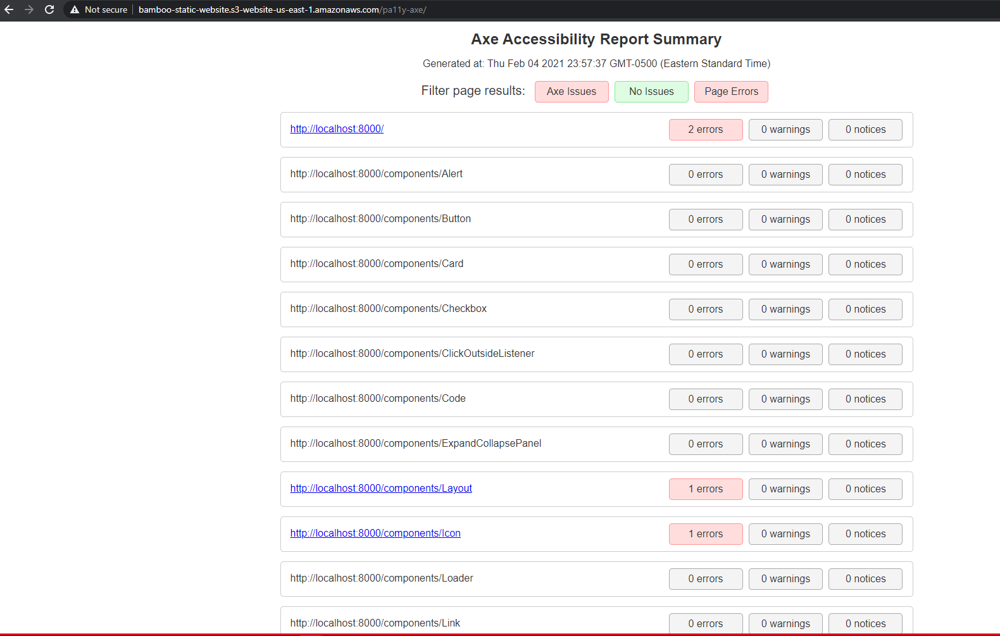

<!-- **Important** package.json change all the yarn commands to bash in order to run. -->
